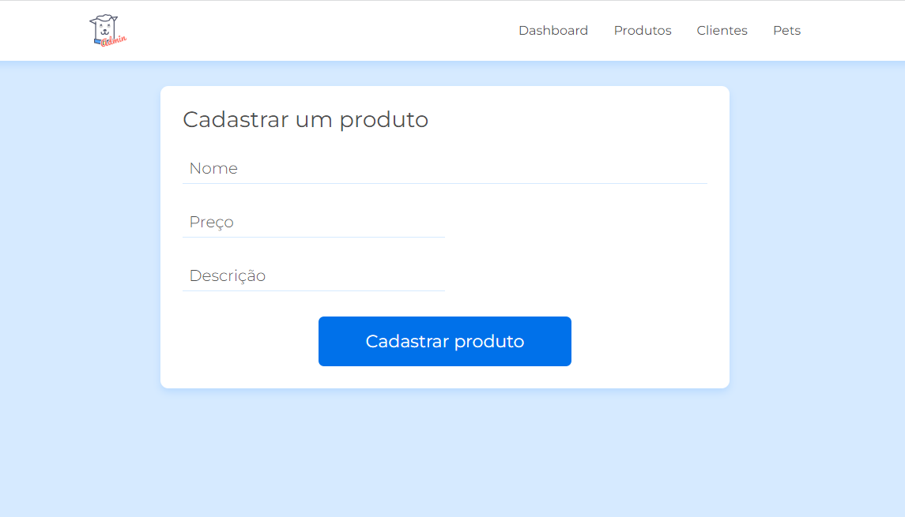
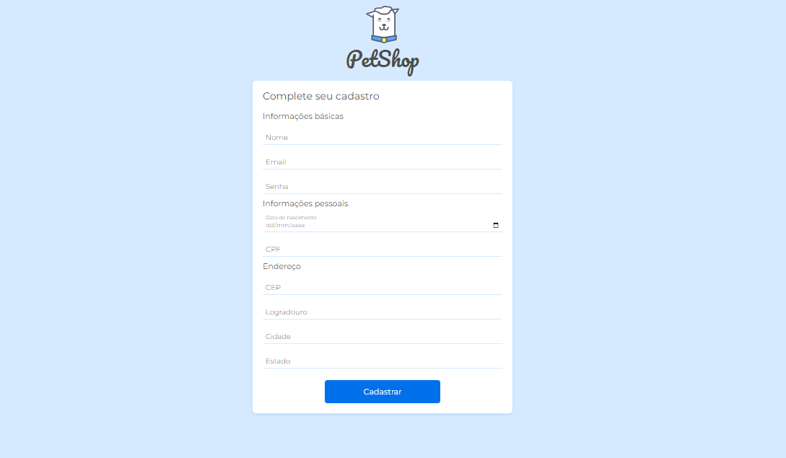

# Projeto Pet Shop

 Projeto do curso validação de formulários da Alura. 

<strong>Objetivos:</strong> 

* Validar formulários com ferramentas do HTML5. 
* Criar validações customizadas com JavaScript como de idade e CPF.
* Preencher o endereço automaticamente com requisições à API da ViaCEP
* Aplicar uma máscara monetária no preço

## 💻 Layout  

### Web

  

  

 ## 🔧 Tecnologias 

As tecnologias usadas foram: 
* HTML
* CSS
* JavaScript
